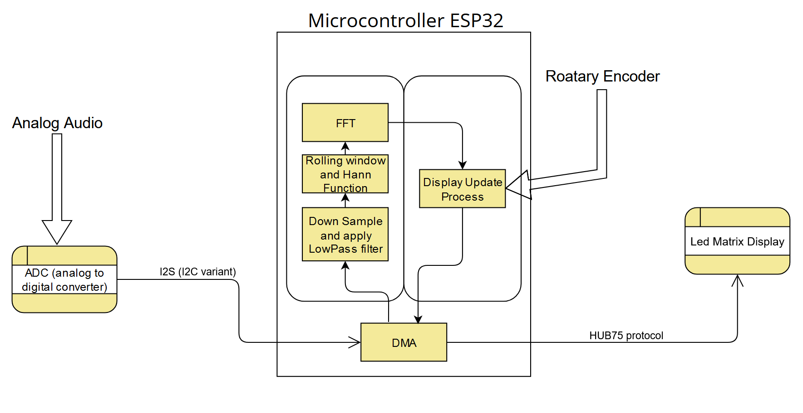
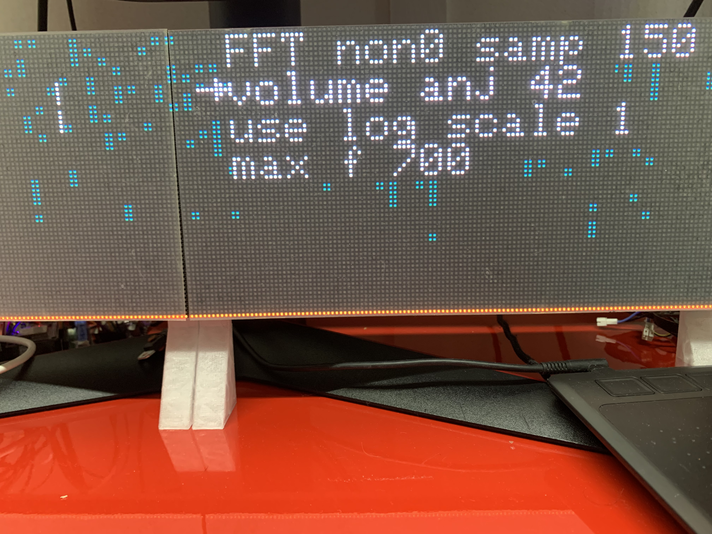
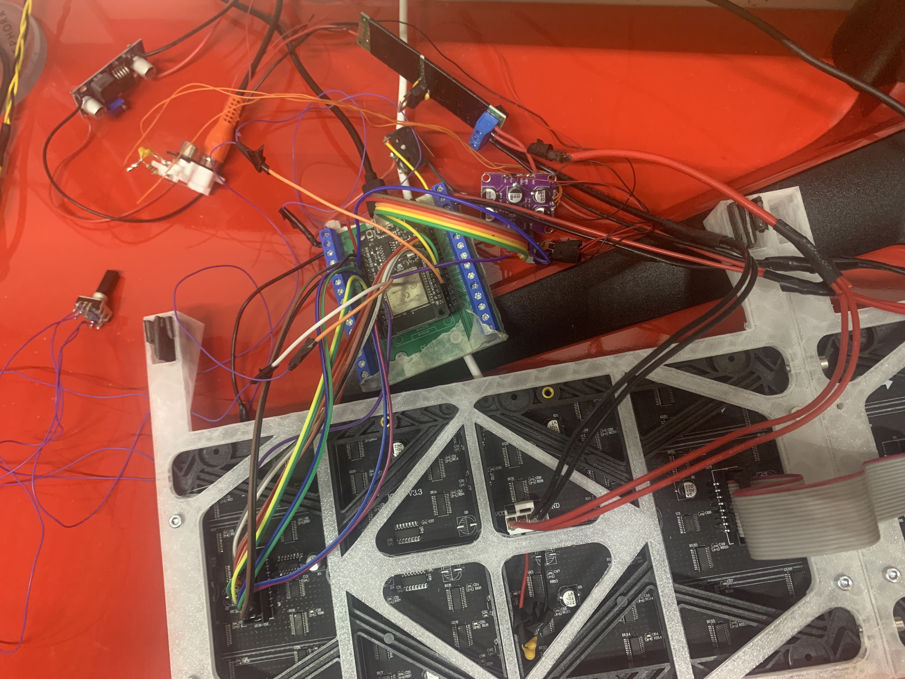

## 🚀 About

This project is a **Sound Spectrogram** designed for visualizing music with a primary focus on achieving a high refresh rate (approximately 100 Hz), for relatively small frequency range (0hz - 700hz) but high resolution. This allows rapid changes in sound to be effectively captured and displayed, even on inexpensive hardware.

The main hardware component utilized is the **ESP32 microcontroller**, chosen for its affordability. However, due to the poor resolution of the ESP32's internal ADC (Analog-to-Digital Converter), it was necessary to integrate an external ADC to ensure higher fidelity in audio capture.  
*See diagram below for reference: *

Rotary encoder is just for user interface. 

For hub75 protocol to comunicate with LED display https://github.com/mrcodetastic/ESP32-HUB75-MatrixPanel-DMA was used.

### Key Features:
To achieve the project's goals, the following were implemented:
- **DMA (Direct Memory Access):** allowed to drive display without any cpu usage, only when pixels have to be change cpu changes pixel values in ram, and DMA handles rest. Another thing that dma is used for is reciving data form external ADC and saving it in ram, so it's read to be procesed for next frame.
- **Two cores usage** dividing work between two cocurrent prcesses achives not only faster refresh rate but also garantise that during long disply pudates of handling user interface sound can still be recived without any sample missed. 
- **Optimized Pixel Update** only pixels that change in reference to previus frames are handled by update process.
- **Down sampling Audio Data** allows to use smaler FFT sample, with external ADC that has minimum sample frequency. But for best results lowpass filer is used befoure downsampling.
- **Rolling window** was used to allow for quick refresh rate while proving fft with suficent amount of samples to get stable resoults. Variable **zero padding** allows to incrase resolution while giving user option to adjust how visible are quick moving sound like drums. Variable zero padding requered to implament preprocessing Hann function as microcontroler was significantly slowed down by calulating it on the fly.
- **Live Adjustents** by using build in menu user can chage parameeters and see instantly what kind of affect thay have. *(Menu Previev: )*

*Working prototype: *

## Showcase

pls add hear [Title](doc/IMG_3433.MOV) [Title](doc/IMG_3433.MOV) but as a playable video with sound

